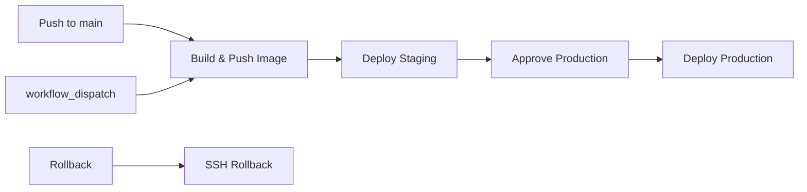

# Deployment Guide

This document describes the automated CD pipeline for NeuraTrade using GitHub Actions.
The pipeline builds a Docker image, deploys to staging automatically, and promotes to production
after manual approval.

## Pipeline Overview



## Required GitHub Secrets

Set these in your repository's **Settings → Secrets and variables → Actions**:

| Secret | Description |
|--------|-------------|
| `REGISTRY_TOKEN` | GitHub PAT with `packages:write` scope for ghcr.io push |
| `STAGING_SSH_KEY` | SSH private key for staging VPS |
| `STAGING_SSH_USER` | SSH username for staging VPS |
| `STAGING_VPS_HOST` | Hostname/IP of staging VPS |
| `PRODUCTION_SSH_KEY` | SSH private key for production VPS |
| `PRODUCTION_SSH_USER` | SSH username for production VPS |
| `PRODUCTION_VPS_HOST` | Hostname/IP of production VPS |

### Generating an SSH key for deployment

```bash
ssh-keygen -t ed25519 -C "neuratrade-deploy" -f ~/.ssh/neuratrade_deploy
```

Add the **public key** (`~/.ssh/neuratrade_deploy.pub`) to `/home/deploy/.ssh/authorized_keys`
on each VPS. Add the **private key** as the GitHub secret value.

## GitHub Environments Setup

Navigate to **Settings → Environments** in your repository and create two environments:

### `staging`
- **No protection rules** — deploys automatically on push to `main`
- VPS must have `/opt/neuratrade/.env.staging` configured

### `production`
- **Required reviewers:** Add `IRFANDI_MARSYA` and at least one other collaborator
- **Wait timer:** Optional (can be set to 0)
- **Deployment branch:** `main`
- VPS must have `/opt/neuratrade/.env.production` configured

## VPS Prerequisites

Each VPS (staging and production) must have:

- Docker and docker-compose installed
- `sqlite3` and/or `pg_dump` for pre-migration backups
- Network namespace `neuratrade_net` created: `docker network create neuratrade_net`
- Environment file at `/opt/neuratrade/.env.staging` or `/opt/neuratrade/.env.production`
- Backup directory: `mkdir -p /opt/neuratrade/backups`

## Triggering a Deploy

### Automatic (push to main)

Push to `main` triggers:
1. `build-and-push-image` — builds Docker image, tags with git SHA + `latest`, pushes to ghcr.io
2. `deploy-staging` — deploys to staging VPS automatically
3. `deploy-production` — requires manual approval before deploying to production

### Manual (workflow_dispatch)

1. Go to **Actions → Deploy → Run workflow**
2. Choose target environment (`staging` or `production`)
3. Optionally specify a different image tag (default: `latest`)
4. For production: after the deploy workflow reaches `deploy-production`, a reviewer must approve

## Rollback

Trigger a rollback via **Actions → Deploy → Run workflow** (no branch push needed):

1. Select **Workflow: Deploy**
2. Choose **Run workflow**
3. Accept the default branch
4. Set environment to roll back (`staging` or `production`)
5. Set `image_tag` to the specific SHA tag to roll back to (e.g., `abc1234`)

If `image_tag` is left empty, the workflow automatically selects the second-most-recent image tag.

### Manual rollback (SSH)

```bash
ssh deploy@staging-vps
# List available images
docker images ghcr.io/irfndi/neuratrade-backend
# Roll back to a specific tag
docker pull ghcr.io/irfndi/neuratrade-backend:abc1234
docker stop neuratrade-staging
docker rm neuratrade-staging
docker run -d \
  --name neuratrade-staging \
  --restart unless-stopped \
  --network neuratrade_net \
  -p 8080:8080 \
  --env-file /opt/neuratrade/.env.staging \
  ghcr.io/irfndi/neuratrade-backend:abc1234
```

## Pre-Migration Backup

Before every deployment, the pipeline automatically runs a database backup:

- **SQLite:** `sqlite3 /path/to/neuratrade.db ".backup /opt/neuratrade/backups/neuratrade_<timestamp>.db"`
- **PostgreSQL:** `pg_dump -U <user> -d <db> > /opt/neuratrade/backups/neuratrade_<timestamp>.sql`

Backups are stored in `/opt/neuratrade/backups/` with a timestamp suffix.

### Restore Procedure

**SQLite:**
```bash
sqlite3 /opt/neuratrade/data/neuratrade.db ".restore /opt/neuratrade/backups/neuratrade_20260101_120000.db"
```

**PostgreSQL:**
```bash
psql -U neuratrade_user -d neuratrade -f /opt/neuratrade/backups/neuratrade_20260101_120000.sql
```

## Canary Deployments (Production)

When deploying to production, the pipeline uses a canary strategy:

1. Start a single canary container on port `8081`
2. Run health check against the canary
3. Monitor for 5 minutes
4. If canary stays healthy: stop old container, start new main container on port `8080`
5. Remove the canary container

If the canary fails health checks or crashes during the monitoring window, the deploy fails
and the old production container continues running.

## Architecture

### Container layout

```
Staging VPS:
  neuratrade-staging  →  port 8080  →  /opt/neuratrade/.env.staging

Production VPS:
  neuratrade-prod      →  port 8080  →  /opt/neuratrade/.env.production
  neuratrade-prod-canary → port 8081  →  /opt/neuratrade/.env.production (temporary)
```

### Image tags pushed to ghcr.io

| Event | Tag | Example |
|-------|-----|---------|
| Push to main | `latest` | `latest` |
| Push to main | SHA | `a1b2c3d` |
| Tag push `v*` | semver | `v1.2.3` |
| Branch push | branch name | `main` |
